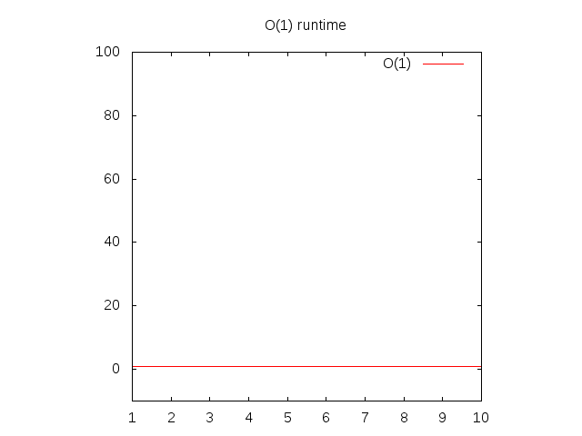
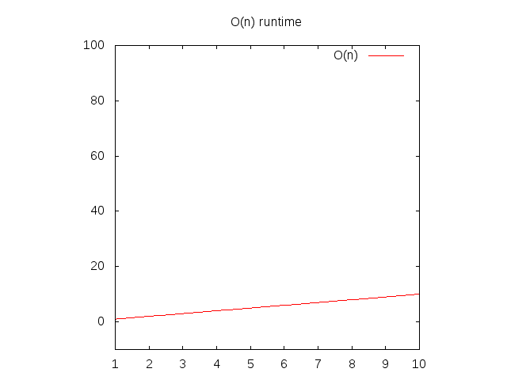
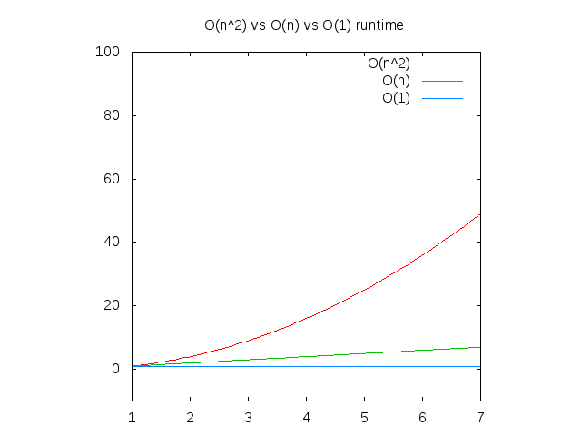
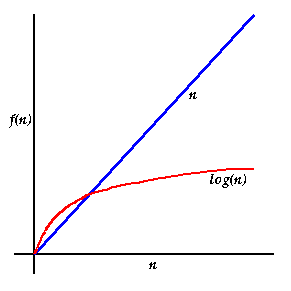
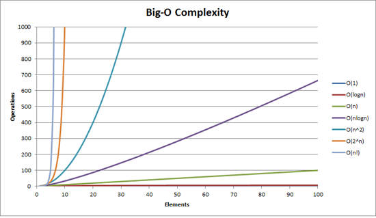

# Algorithms & Big O Notation in Plain English

by Pavan Katepalli

Edited by 

[Nick Bartlett](https://github.com/tteltrab)

[Nick West](https://github.com/njwest)


## What are algorithms?

Algorithms are basically functions.

Functions that are algorithms:

1. take in arguments

2. explicitly return values

#### 1.1 Example of an algorithm

Algorithm that counts the number of vowels in a word and returns the count:

```js
function countVowels(word) {
    var vowels = ['a', 'i', 'e', 'o', 'u'];
    var count = 0;
		for (var i = 0; i < word.length; i++) {
        for (var j = 0; j < vowels.length; j++) {
            if (word[i] === vowels[j]) {
                count++;
            }
        }
    }
    return count;
}

```

## When are functions not algorithms?
When you write a function it may or may not

* have arguments

* return a value

Functions that don't take arguments or return a value are usually used to dry up repetitive code, print something to the screen, or serve as an argument to be executed later. These types of functions typically aren't referred to as algorithms.

#### 1.2 Example of a function that is not an algorithm

An anonymous function that gets passed to jQuery's `on` function. 

```js
$('button').on('click', function(){ 
	alert('hi') 
});
```

#### 1.3 Example of a function that is not an algorithm

This function has no arguments, no return

```js
function clearDiv(){
	$('#div').html("");
}
```
#### 1.4 Example of a function that is not an algorithm

This function has an argument, but no return

```js
function clearDiv(text){
	$('#div').text(text);
}
```

## What is Big O?

Big O is short for Big O Notiation.

Big O is how programmers talk about scalability of algorithms.

An algorithm's Big O Notation is determined by how long the algorithm takes to return output in the **worst case scenario**.

The math term for the **worst case scenario** is **"upper bound"**.

## How do you say O(n)

O(n) reads as "Order of N" or short for "O of N".

The O function is the Order function.

## Why is it called Big O?

Because we're dealing with orders of magnitude. `O` is used because the growth rate of a function is also referred to as the **"order of the function"**.

## Why is Big O important?

Understanding the Big O of algorithms will
* get you into the mindset of coding for efficiency. Ex: "I have to change this algorithm because it's O(n!)!"
* help you talk code to other developers. Ex: "Don't worry, I changed up the algorithm so it not O(n^2). It's O(n) now."
* help you for interviews. You will be able to talk about efficiency of algorithms that you whiteboard. Ex: "What I just coded out is O(n^2)."

## Dive into O(1)

#### Example 2.1

```js
function returnItem(item){
	return item;
}
```

`returnItem` is a pointless function, but bear with me.

```js
returnItem(2);
```

`returnItem`'s Big O is constant time. No matter what we pass to `returnItem`, the algorithm will go through one unit of work.

The "complexity" of this function is `O(1)`.

If you want to graph `O(1)` then you would set y equal to 1 and graph it.

**y = 1**



Notice that the further right of the horizontal axis (x axis) you go, the vertical axis (y axis) stays the same.

## Dive into O(n)

#### Example 2.2
```js
function itemInList(check, list){
	for (var i = 0; i < list.length; i++){
		if (list[i] === check) return true;
	}
	return false;
}
```

This will run pretty quick:

```js
itemInList(2, [1,2,3]);
```

The "complexity" of `itemInList` is `O(n)`.

This means that it's a linear graph.

For `itemInList`, if the length of the array is 3; **worst case** it'll take 3 units of work.

Sure, in the best case it'll take 1 unit of work, but Big O Notation isn't about the best case scenario, it's about the **worst case scenario**.

If you want to graph `O(n)` then you would replace the `n` with a `x` and set it equal to a `y`.

**y = x**



Notice that the further right of the horizontal axis (x axis) you go, the vertical axis (y axis) goes up too.

## Dive into O(n^2)

#### Example 2.3
```js
function allCombos(list){
	var results = [];
	for (var i = 0; i < results.length; i++){
		for (var j = 0; j < results.length; j++){
			results.push([i, j]);
		}
	}
}
```

If we do `allCombos([1,2,3])` we'd get back `[(1,1) (1,2), (1,3), (2, 1), (2, 2), (2, 3), (3, 1), (3, 2), (3, 3)]`.

The "complexity" of `allCombos` is `O(n^2)`.

The length of the list argument of `allCombos` is the `n` in `O(n^2)`.

allCombos([1]) -> [[1,1]]. One unit of work.  1^2 = 1
allCombos([1,2]) -> [[1,1], [1,2], [2,1], [2,2]]. Four units of work. 2^2 = 4

So n * n is n^2.

## Comparison of O(1), O(n), O(n^2)

Notice that the further right of the horizontal axis (x axis) you go, the vertical axis (y axis) goes up fastest for `O(n^2)`, slower for `O(n)` and constant for `O(1)`.

This means that `O(n^2)` runs slower than `O(n)`, which runs slower than `O(1)`.



## O(1) vs O(n) vs O(n^2) explained without code

#### O(1)
Consider single-digit addition with a pencil and paper. The kind you learned when you were young.

```
5 + 5 = 10

3 + 3 = 6

2 + 2 = 4

2 + 3 = 5

6 + 7 = 13
```

Each of those different problems took the same # of operations to complete (or the same amount of units of work to complete). You take one number and add it to another. Done.

Because it's always the same units of work to complete, no matter what the problem, the Big O is constant, this is an example of `O(1)`.

#### O(n)

Consider multi-digit addition with a pencil and paper.

```
55 + 72 = 127

455 + 322 = 777

1234 + 4447 = 5681

4999 + 56 = 5055
```

Notice how the number of operations (or the amount of units of work to complete) goes up as the number of digits go up.

The number of operations directly correlate (are one to one) with the number of digits of the biggest number being added.

This would take worst case `O(n)` units of work.

#### O(n^2)

Now, consider multi-digit multiplication with pencil and paper.

```
55538 * 92338 = 5128267844
```

This is much harder to do than the previous two asks.

Each digit of the bottom number has to be multiplied by each digit in the top number.

If you were multiplying 100 digit numbers by each other then it would take 10,000 mathematical operations to complete (units of work to complete).

This would take worst case `O(n^2)` units of work to complete.

## Dive into O(log(n))

O(1) < O(log(n)) < O(n) < O(n^2)



#### What does an algorithm look like that has a Big O of O(log(n))?

The choice of the next element on which to perform some action is one of several possibilities, and only one will need to be chosen.

#### Ex. Looking up people in a phone book is O(log(n))

You don't need to check every person in the phone book to find the right one; instead, you can simply divide-and-conquer, and you only need to explore a tiny fraction of the entire space before you eventually find someone's phone number.

Of course, a bigger phone book will still take you a longer time, but it won't grow as quickly as the proportional increase in the additional size.

#### Ex. an algorithm that has a Big O of O(log(n))

```js
function twoDivides(x){
	var count = 0;
	while (parseInt(x) > 1) {
		x = x / 2;
		count = count + 1;
	}
	return count;
}
```

##### Calculating the Big O of algorithm above

**without math**

Often you don't need math to figure out what the Big-O of an algorithm is. You can simply use your intuition.

You look at how many units of work the algorithm has to do as the input grows and match that up to the correct Big O.

Not counting the return or the variable declaration:  
twoDivides(2) = 1. The operations for each step of the loop would be x = 2/1 (for the division) & count = 0 + 1 (for the count); so 2 total.  
twoDivides(4) = 2. The operations would be `x = 4/2` & `count = 0 + 1`, `2/1` & `1 + 1`; so 4 total.  
twoDivides(8) = 3. The operations would be `x = 8/2` & `count = 0 + 1`, `4/2` & `1 + 1`, `2/2` & `2 + 1`; so 6 total.  
twoDivides(16) = 4. The operations would be `x = 16/2` & `count = 0 + 1`, `8/2` & `1 + 1`, `4/2` & `2 + 1`, `2/2` & `3 + 1`, so 8 total.  
twoDivides(32) = 5. The operations would be `x = 32/2` & `count = 0 + 1`, `16/2` & `1 + 1`, `8/2` & `2 + 1`, `4/2` & `3 + 1`, `2/2` & `4 + 1`; so 10 total.  

The "complexity" of twoDivides is `O(log(n))`.  

n    |  operations
-----|---------------
2    |  2
4    |  4
8    |  6
16   |  8
32   |  10
...  | ...
n    | 2 * log(n)

`log(n)` here essentially means "the number of times we can divide `n` by 2".

**Side note:** When writing Big O Notation, the leading "2" would be ignored - it doesn't change significantly the asymptotic behavior of the function for large values of `n`. Thus, we can see `O(2 * log(n))` is equivalent to `O(log(n))`. In general, when writing Big O notation you only care about the most significant portion of complexity (even `2n^2 + 2n` would be written as `O(n^2)`.
    
In this case (`log(n)`), The size of the number is the `n`. We can see that the number of operations isn't constant, but doesn't grow linearly (and grows more slowly as the `n` increases).

**general case, with math** 

Iteration |   x
----------|--------
0         |  x (this is the same thing as x/1)
1         |  x/2
2         |  x/4
...       |  ...
k         |  x/2^k 

2^k = x → Applying log to both sides → k = log(x)

log(2^k) = log(x)

k*log(2) = log(x)

k = log(x)/log(2)

k approximately equals log(x)

## Dive into O(n log n)

O(1) < O(log(n)) < O(n) < O(n log(n)) < O(n^2)

```js
// assume that n is an integer
function nlogn(n){
	var results = [];
	for (var i = 0; i < n; i++){ // this loop is executed n times, so O(n)
	    for (var j = n; j > 0; j = parseInt(j/2)){ // this loop is executed log(n) times, so O(logn)
	    	results.push(j);
	    }
	}
	return results;
}
```

For adjacent for loops you would add the runtimes together, e.g. `O(n + m)`. For nested for loops, you multiply them, e.g. `O(n*m)`, or in this case `O(nlogn)`.

This would result in 

```
nlogn(3)
[3, 1, 3, 1, 3, 1]
```

```
nlogn(4)
[4, 2, 1, 4, 2, 1, 4, 2, 1, 4, 2, 1]
```

## Dive into O(2^n)

Algorithms with a Big O of 2^n are usually recursive.

```js
// assume number is an integer
function fib(number) {
 if (number <= 1) return number;
 return fib(number - 2) + fib(number - 1);
}
```

`O(2^n)` occurs when a problem of size `n` requires solving two smaller problems of size `n-1` (in fibonacci this is close to true, it's just two problems one of size `n-1` and the other of size `n-2`. In essence, you're doubling the number of problems you need to solve every time n increases.

Assume our algorithm takes two operations, and that solving a problem of size `n` requires solving two problems of size `n-1`. Then, the number of operations for increasing values of `n` are:

n   |  ops(n)
--- | ---
1   | 2 
2   | 4 = 2 + 2 = ops(2-1) + ops(2-1) = 2(2) = 2^2
3   | 8 = 4 + 4 = ops(3-1) + ops(3-1) = 2(4) = 2(2^2)= 2^3
4   | 16 = 8 + 8 = ops(4-1) + ops(4-1) = 2(8) = 2(2^3) = 2^4
...
k   | (k-1) + (k-1) = 2(k-1) = 2((k-2) + (k-2)) = 4(k-2) = 8(k-3) = ... = 2^(k-1)(2) = 2^k

## Dive into O(n!)

Any algorithm that calculates all permutations of a given array is `O(n!)`. Factorial is the number you get if you multiply every number from 1 to `n`.

Imagine you have an array of words, and you want to return all possible combinations of those words.

So given
```
['apple', 'bear', 'limp bizkit']
```

The algorithm would return an array of 6 arrays. Like this:
```
[
	['apple', 'bear', 'limp bizkit'],
	['apple', 'limp bizkit', 'bear'],
	['bear', 'limp bizkit', 'apple'],
	['bear', 'apple', 'limp bizkit'],
	['limp bizkit', 'bear', 'apple'],
	['limp bizkit', 'apple', 'bear'],
]
```
Writing an algorithm that would do that would be `O(n!)`. `n` here is the length of the array, so 3! = 3 * 2 * 1 = 6. 

Another example:

```js
// assume n is an integer
function nFactorial(n) {
  for (var i = 0; i < n; i++) {
    return nFactorial(n - 1);
  }
}
```

This runs the `nFactorial` function `n-1` times for an input `n`. So, you get `n*nFactorial(n-1)`.

`n*f(n-1) = n*(n-1)*f(n-2) = ... = n*(n-1)*(n-2)*...*1*f(1) = n!`.

## Big O can be misleading

Big-O notation is an estimate and is only useful for large values of n.

#### insertion sort vs merge sort

The worst-case running time for the **insertion sort algorithm is O(n^2)**.

Relative to Big O that is worse than the running time for **merge sort, which is O(n log n)**.

But for small amounts of data (when n is small), insertion sort is actually faster, especially if the array is partially sorted already!

Big O is useful when comparing two algorithms to figure out which one runs faster for when n is large.

If the amount of data (n) is relatively small, then even a slow algorithm will be fast enough for practical use.

#### Other concerns

The average runtime of algorithms can vary significantly for differing inputs, but Big O notation only indicates the worst case scenario. Thus, you can one algorithm which runs `logn` in 99% of cases, but 1% of the time takes `n!` time, and another which solves the same problem but always runs `n^2`. Thus, Big O notation doesn't give the whole picture of runtime efficiency. This is particularly notable when looking at soting algorithms, which have varying best, worst, and average case runtimes. Most discussions surrounding runtime analysis do, however, focus on Big O and worst-case rintime.

## Other Big O Categories from fastest to slowest

Big-O | Name | Description
------| ---- | -----------
**O(1)** | constant | **This is the best.** The algorithm always takes the same amount of time, regardless of how much data there is. In other words, the number of units of work it takes the algorithm to complete is independent of the size of the input. Example: looking up an element of an array by its index.
**O(log n)** | logarithmic | **Pretty great.** These kinds of algorithms remove a percentage of the amount of data to sift through with each iteration. If you have 100 items, it takes about 7 steps to find the answer. With 1,000 items, it takes 10 steps. And 1,000,000 items only take 20 steps. This is super fast even for large amounts of data. Example: binary search (sorted array search).
**O(n)** | linear | **Good performance.** If you have 100 items, this does 100 units of work. This is usually the case for a loop. If you double the size of n, then the algorithm does 2 * n units of work. Example: unsorted array search.
**O(n log n)** | "linearithmic" | **Decent performance.** This is slightly worse than linear but not too bad. Example: mergesort and other "fast" sorting algorithms.
**O(n^2)** | quadratic | **Kinda slow.** If you have 100 items, this does 100^2 = 10,000 units of work. Doubling the number of items makes it four times slower (because 2 squared equals 4). Example: a double for loop -> you have to look at every pair of input elements.
**O(n^3)** | cubic | **Poor performance.** If you have 100 items, this does 100^3 = 1,000,000 units of work. Doubling the input size makes it eight times slower. Example: matrix multiplication. Or, you're looking at every pair of inputs but the operation you do requires looking at all of the inputs again
**O(2^n)** | exponential | **Very poor performance.** You want to avoid these kinds of algorithms, but sometimes you have no choice. Adding just one bit to the input doubles the running time. Example: brute-force guessing results of a sequence of `n` coin flips.
**O(n!)** | factorial | **Intolerably slow.** It literally takes a million years to do anything. Example: you need to consider every possible subset of your inputs. Check out the traveling salesperson problem - brute forcing a solution for it is `n!`.



## another chart

Big-O | computations for 10 things | computations for 100 things
------| ---- | -----------
O(1)        |   1                         |     1
O(log(n))   |   3                         |     7
O(n)        |  10                         |   100
O(n log(n)) |  30                         |   700
O(n^2)      | 100                         | 10000
O(n^3)      | 1000                         | 1000000
O(2^n)      | 1024                         | 2^100
O(n!)      | 3628800                         | 100! -> mathematically this is the product of (100 * 99 * 98...)

## and another

n   | logn | n  | nlogn | n^2 | 2^n | n!
--- | ---  |--- | ---   |---  | --- | ---
1   | 0    | 1  | 0     | 2   | 2   | 1
2   | 3.69 | 2  | 1.4   | 4   | 4   | 2
3   | 1.1  | 3  | 3.3   | 9   | 8   | 6
4   | 1.4  | 4  | 5.5   | 16  | 16  | 24
5   | 1.6  | 5  | 8     | 25  | 32  | 120
10  | 2.3  | 10 | 23    | 100 | 1024| 3628800 


## Pop Quiz

What's the Big O of each of these algorithms?

a)

```js
function countUpA(n){
	var count = 0;
    for (var i = 1; i <= n; i++) {
        for (var j = n; j > 1; j--) {
            for (var k = 1; k < n; k = k + 2) {
                count++;
            }
        }
    }
    return count;
}

```

b)
```js
function countUpB(n){
	var count = 0;
	for (var i = 1; i <= n; i++) {
	    for (var j = n; j > 1; j--) {
	        for (var k = 1; k < 1000; k = k + 2) {
	            count++;
	        }
	    }
	}
	return count;
}

```

c)
```js
function countUpC(n){
	var count = n;
	for (var i = 1; i <= 1000000; i++) {
	    for (var j = i; j > 500; j--) {
	        for (var k = 1; k < 10500; k = k + 2) {
	            count++;
	        }
	    }
	}

	return count;
}

```
d)

```js
function countUp(n){
	var count = 0;
	var j = 1;
	for (var i = 1; i < n; i++) {
        while (j < n) {
            j++;
            count++;
        }
        j = 1;
	}
	return count;
}

```

e)

```js
function countUpE(n){
	var count = 0;
	var i = n;
	while (i > 1){
	    count++;
	    i = i / 2;
	}
	return count;
}

```


## Answers to Quiz

a) O(n^3)

triple for loops, as the input grows, the units of work grows at a cubic pace.

b) O(n^2)

triple for loops, but only 2 of the for loops increase the units of work respect to the input

c) O(1)

as the input grows, the units of work always stays the same

d) O(n^2)

as the input grows, the units of work increase at a quadratic pace

e) O(log n)

as the input grows the units of work go up but not at a linear or quadratic pace.


## Resources used

Explanations:
https://justin.abrah.ms/computer-science/big-o-notation-explained.html
http://stackoverflow.com/questions/107165/big-o-for-eight-year-olds?rq=1

Example Code Samples reworked from here:
http://stackoverflow.com/questions/17122807/big-o-ologn-code-example
http://stackoverflow.com/questions/19021150/big-oh-for-n-log-n

Chart/Graphics Used:
https://github.com/raywenderlich/swift-algorithm-club/blob/master/Big-O%20Notation.markdown
https://www.quora.com/How-would-you-explain-O-log-n-in-algorithms-to-1st-year-undergrad-student
http://www.daveperrett.com/articles/2010/12/07/comp-sci-101-big-o-notation/

Pop Quiz:
http://stackoverflow.com/questions/9223351/confused-on-big-o-notation?rq=1
